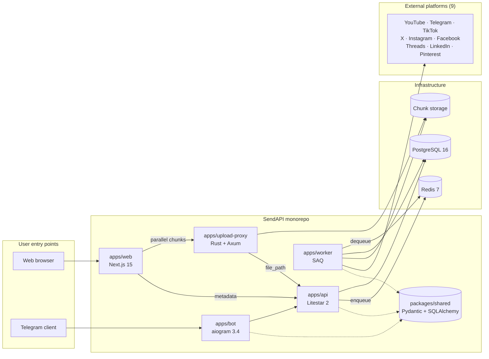
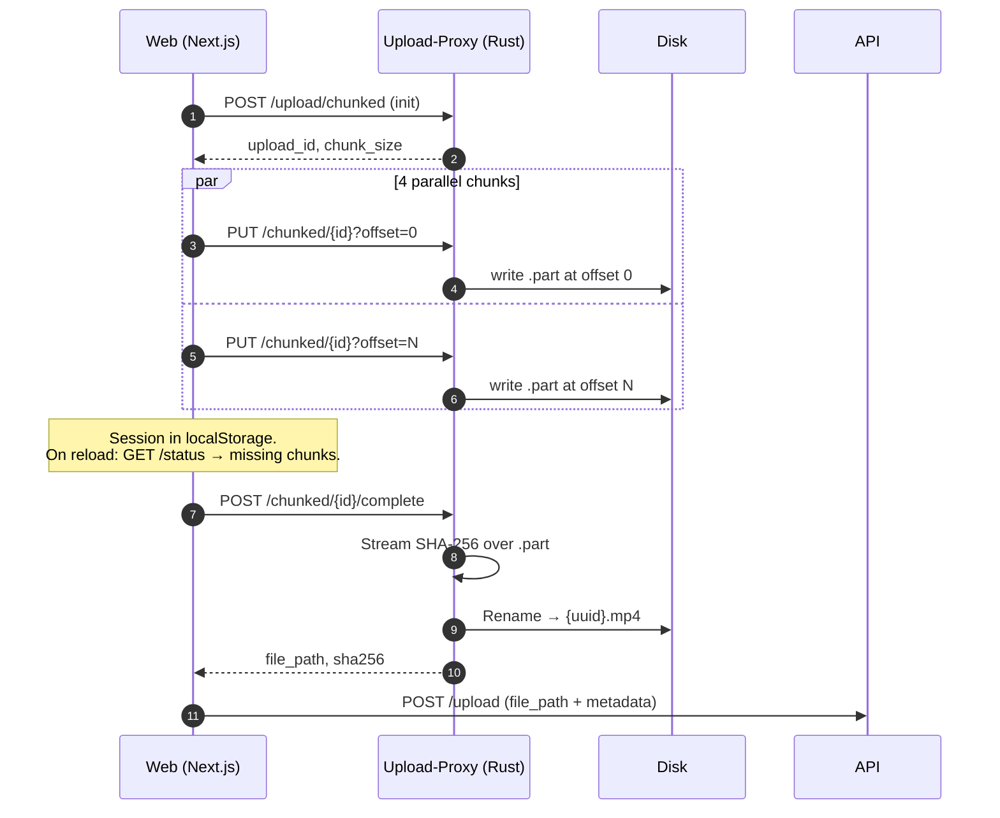
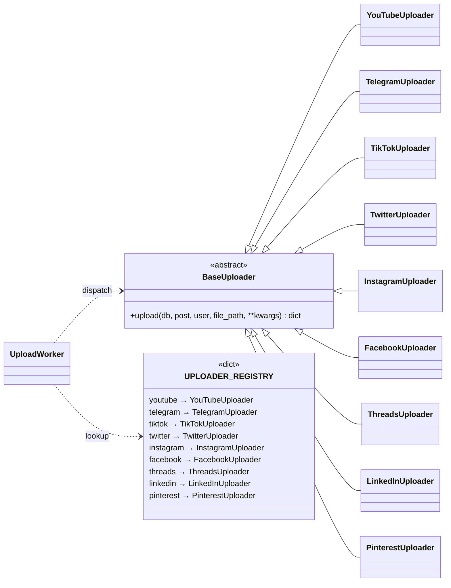

# SendAPI — Omnichannel Posting SaaS

> A case study by Artem Samoilov.
> Stack: Python · Rust · TypeScript.
> Role: sole engineer — architecture, implementation, deployment.

## TL;DR

SendAPI lets a creator upload a video once and publish it to 9 social platforms — YouTube, Telegram, TikTok, X, Instagram, Facebook, Threads, LinkedIn, Pinterest — via a Telegram bot or a web UI. It is a monorepo of six services: a Rust streaming upload proxy, a Python REST API, a Python Telegram bot, a Python background worker, a Next.js web UI, and a shared Python package holding DTOs and DB models. This write-up is a senior-to-senior walkthrough of the architecture and the decisions behind it.

## The product

The problem is boring and real: creators post the same content to many platforms and each platform has its own API, file-size limits, chunking rules, auth flow, and quirks. SendAPI gives them one upload and one form — pick platforms, pick caption, publish — and handles the nine-way fan-out.

Two entry points exist for the same core pipeline:

- **Web UI** — Next.js 15 dashboard with a chunked, resumable uploader. Target: creators uploading large video files from desktop.
- **Telegram bot** — aiogram FSM flow (media → title → description → tags → platforms → confirm). Target: creators already living inside Telegram, where the "video" is a `file_id` that never has to leave Telegram's infrastructure.

Both feed into the same API, DB, worker, and uploader registry.

## System architecture

The system is deliberately sized between "monolith" and "microservices". Six services, each with one clear responsibility; shared code lives in one Python package (`packages/shared`) and is imported — never duplicated — across Python services.

| Service             | Language   | Responsibility                                                                                                                           |
| ------------------- | ---------- | ---------------------------------------------------------------------------------------------------------------------------------------- |
| `apps/web`          | TypeScript | Next.js 15 dashboard, chunked uploader, OAuth UI for connecting platform accounts.                                                       |
| `apps/bot`          | Python     | aiogram 3.4 bot with FSM-driven upload flow, webhook + polling modes.                                                                    |
| `apps/upload-proxy` | Rust       | Streaming chunked upload server. Constant memory regardless of file size. Bitmap-based chunk bookkeeping, streaming SHA-256 on complete. |
| `apps/api`          | Python     | Litestar 2 REST API. Post creation, platform account management, OAuth callbacks, quota enforcement, task enqueuing.                     |
| `apps/worker`       | Python     | SAQ-driven worker. Dequeues post tasks, downloads media, iterates `UPLOADER_REGISTRY`, reports results. Horizontally scalable.           |
| `packages/shared`   | Python     | Pydantic DTOs, SQLAlchemy models, config base, i18n helpers. Imported by every Python service.                                           |

State lives where it should: **in-flight bytes** on the proxy's disk, **metadata** in PostgreSQL, **pending work** in Redis, **UI session** in browser `localStorage`. Every service is stateless except for the proxy, which owns a small per-upload on-disk directory.

## Deep-dive #1: Streaming chunked uploads

The upload pipeline is the most technically interesting part of the system. It is also the piece that justifies Rust.

### The problem

A creator may be uploading a 4 GB video on a flaky home connection. A naive single `POST` means:

- if the connection blips at 90%, the whole upload restarts
- the server holds the entire file in memory or streams it through a framework that probably wasn't designed for constant-memory streaming
- concurrent parallel uploads from the same browser waste a tab's bandwidth budget

### The solution

**Browser side** (`apps/web/src/lib/chunkedUpload.ts`):

- File is split into fixed-size chunks. A worker pool of four pulls from a queue and `PUT`s chunks to `/upload/chunked/{id}?offset=X` in parallel.
- Each chunk's completion increments a local byte counter for progress. Progress is not fetched from the server — the browser already knows.
- The upload session is persisted to `localStorage` keyed by a file fingerprint (name + size + last-modified). On reload the uploader calls `GET /status`, gets the list of missing chunks, and resumes only those.

**Proxy side** (`apps/upload-proxy/src/chunked.rs`, `session.rs`):

- Each `PUT` validates chunk bounds _before_ touching the filesystem — a bad request never corrupts the `.part` file.
- Writes to the `.part` file at the chunk's offset. Parallel writes to different offsets are safe and don't need coordination beyond an `fsync` at the boundary.
- A bitmap tracks which chunks have been received; mutating it is guarded by a short-held mutex. Idempotency falls out for free — re-`PUT`ting the same chunk is a no-op.
- `POST /complete` verifies all chunks are present, streams the entire `.part` through a SHA-256 hasher without ever loading the full file into memory, renames to the final path, and returns `{file_path, size, sha256}` to the browser.

### Why Rust here specifically

This service holds a single responsibility — **move bytes from HTTP to disk with constant memory, correctly, under concurrency**. Rust's strengths (zero-cost async via Tokio, strict ownership over buffers, compile-time guarantees that a bitmap mutation happens under a lock) match the job exactly. A Python version would work and probably ship faster initially, but the safety margin around concurrent writes and memory usage under load is the thing I wanted to own at compile time, not at 3 AM.

The rest of the stack is Python because the rest of the stack is orchestration, API integrations, and business logic — where Python's SDK ecosystem and iteration speed matter more than raw throughput.

## Deep-dive #2: Pluggable platform uploaders

Nine external platforms, each with a different upload API, different auth flow, different constraints. A naive implementation — `if platform == "youtube": ... elif platform == "tiktok": ...` — rots fast.

The worker holds no platform-specific code. It iterates the post's platform list, looks up a class in `UPLOADER_REGISTRY`, calls `uploader.upload(...)`, and aggregates results. Adding a platform is one new file plus one line in the registry.

**What lives inside each uploader (examples):**

- `YouTubeUploader` wraps the Google API client's resumable upload. Chunk size is configurable; transient network errors resume from the last acknowledged byte.
- `TikTokUploader` implements TikTok's `init → append → finalize` flow. TikTok requires chunks between 5 and 64 MB with a specific last-chunk rule; the implementation picks 10 MB base chunks and absorbs the remainder into the last chunk (floor division — ceiling division produces a last chunk TikTok rejects).
- `TelegramUploader` takes a shortcut: if the media originated inside Telegram (bot flow), it uses the existing `file_id` instead of downloading and re-uploading. When the file came from the web, it falls back to `FSInputFile`.

Platform quirks are isolated. The worker doesn't know or care.

### The design rule

The worker's `for platform in post.platforms:` loop imports `UPLOADER_REGISTRY` and nothing else platform-specific. Platform-related code — including `from sendapi_shared import Platform` enum references and per-platform quota/rate-limit logic — lives in the uploader class or in helpers the uploader composes. New platform? One class, one registry entry, no edits to the worker.

## Tech decisions journal

A selection of non-obvious choices and the one-line reason behind each.

- **Monorepo with six services, not microservices.** Shared Python package (`packages/shared`) gives most of the "don't duplicate code" benefit of microservices with none of the "eleven deployment pipelines" cost. Each service is a directory, not a repo.
- **Rust only for the upload proxy.** Constant-memory byte-moving is where Rust earns its weight. The rest of the stack — where I/O waits dominate and SDK ecosystems matter — stays in Python.
- **Litestar over FastAPI.** Better-typed DI, cleaner plugin surface, first-class OpenAPI, and Pydantic 2 support without the warts. The web client's type-safe API layer generates from Litestar's OpenAPI output.
- **SAQ over Celery.** Async-native, redis-only, drastically simpler. Celery's complexity was not paying for itself on this workload.
- **PostgreSQL + Redis, not Kafka + Mongo.** Nothing here is a Kafka-scale problem. Every workload fits comfortably in Postgres row operations and Redis queues. Choosing boring infrastructure is itself a decision.
- **Coolify on self-hosted VPS.** Not Kubernetes. The total traffic profile doesn't justify the operational tax. Coolify gives me Docker Compose ergonomics with a web UI and automatic deployment on git push — appropriate complexity for the current scale.
- **aiogram FSM for the bot.** The bot's upload flow is a multi-step conversation (media → title → description → tags → platforms → confirm). FSM makes "what state is this user in, and what does any given message mean in that state" explicit instead of implicit.
- **Pydantic Settings for all config.** No `os.getenv` calls in business code. Every tunable (chunk size, pool size, timeout, threshold) is a typed field on a settings class, loaded from env and validated at startup.

## Production & ops

The things between "it works on my laptop" and "it runs for real users" are wired up:

- **Deploy**: Docker Compose for dev and prod (`docker-compose.yml` + `docker-compose.prod.yml`). Coolify watches the main branch and redeploys on merge.
- **Schema**: Alembic migrations generated from the shared SQLAlchemy models. `make migrate-create msg="..."` to generate, `make migrate-up` to apply.
- **Observability**: Datadog APM traces every service; structured JSON logs are forwarded to Datadog Logs. Custom metrics track per-platform upload success, quota usage, and queue depth.
- **Quality gates**: Ruff (Python) and Clippy (Rust) enforced via pre-commit. A sync hook keeps `.junie/guidelines.md` and `CLAUDE.md` from drifting.
- **Testing**: pytest + pytest-asyncio for Python services, `tokio::test` + `tower::ServiceExt::oneshot` for the Rust proxy. No test hits real infrastructure — everything mocked at the service boundary.
- **Horizontal scaling**: the worker is stateless; more instances = more parallel post processing. API and web are also stateless. Only the upload-proxy has disk-backed state, and even that is scoped to individual upload sessions.

## What I'd do differently

Three honest observations from shipping this system.

**Parallel platform uploads inside a post.** The worker processes a post's platforms sequentially (`for platform in post.platforms: ...`). For a post going to five platforms, that's five serial round trips to external APIs, each dominated by I/O wait. A bounded `asyncio.gather` over the platforms would cut wall-clock by a factor close to the platform count, with careful handling of per-platform rate limits (Telegram especially) and per-post quota reservations (Twitter especially). The current design is correct and simple; the gather version is correct and fast. I'd take the gather version on any rewrite.

**Move Twitter quota reservation earlier.** Twitter quotas are reserved inside the worker's platform loop, right before the upload call, and released on failure. That works when the loop is sequential; it becomes subtle under `gather`. A cleaner factoring reserves all quotas at the start of the task for all platforms it will touch, and releases unused reservations at the end. This is a pre-refactor I'd land before parallelising the platform loop.

**Redis Cluster, maybe.** Everything Redis-backed today (SAQ queue, session cache) fits in a single Redis instance with comfort. If the service's queue depth ever justified it, moving to Redis Cluster is a one-time operational lift that's easier to plan for now than to execute under pressure. I'd add that to the "when things get real" checklist but not build it today — YAGNI is the right call for a side-project at this stage.

## Contact

- Upwork: https://upwork.com/freelancers/samoylovartem
- LinkedIn: https://www.linkedin.com/in/samoilovartem/
- Email: samoylovartem@labslumen.com
